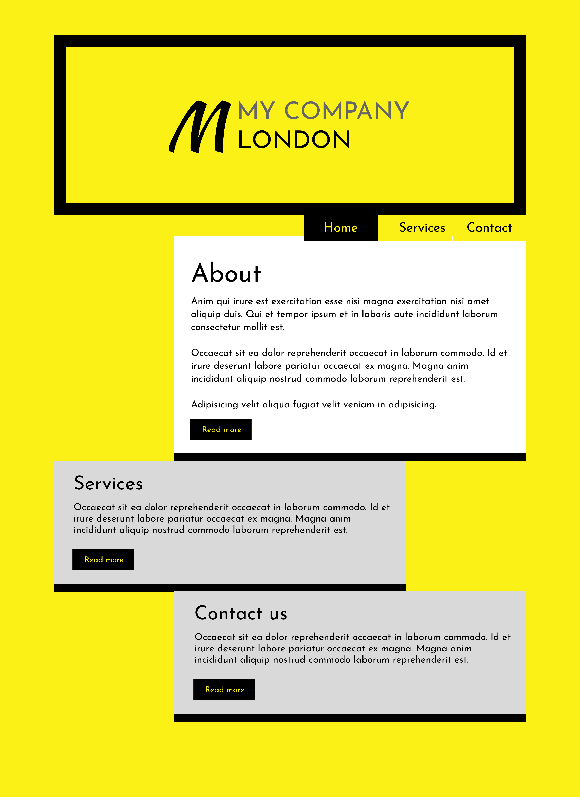
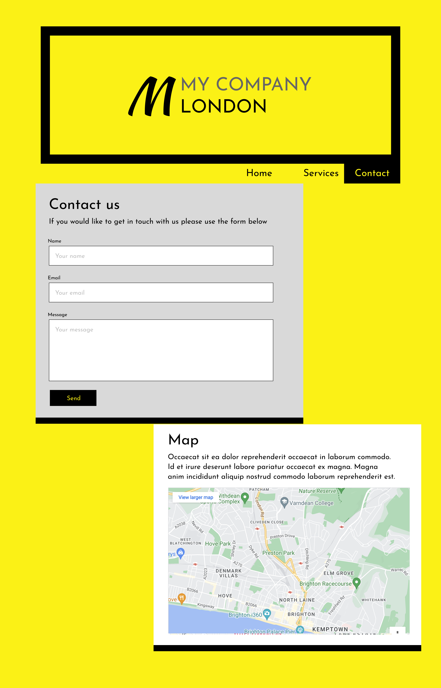
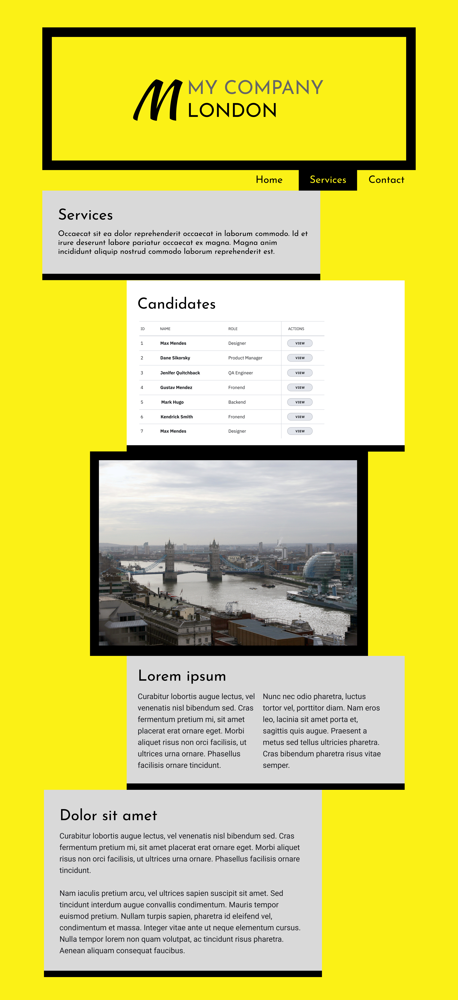

# HTML & CSS Flexbox Layout Task

This project was another layout challenge where we were given a design to recreate using **HTML** and **CSS**, this time focusing more on **Flexbox** for positioning and alignment.

## What I Used
- HTML  
- CSS (Flexbox)

## What I Learned
I practised using Flexbox for layout control, including alignment, spacing, and responsive structure.  

Design given:

